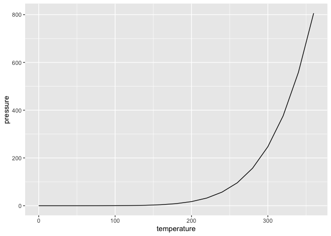

## Hello TA!

## GitHub Documents

## Code

    dplyr::summarise(cars, speed = mean(speed), dist = mean(dist))

    ##   speed  dist
    ## 1  15.4 42.98

## Plots

Note that the `echo = FALSE` parameter was added to the code chunk to
prevent printing of the R code that generated the plot.
